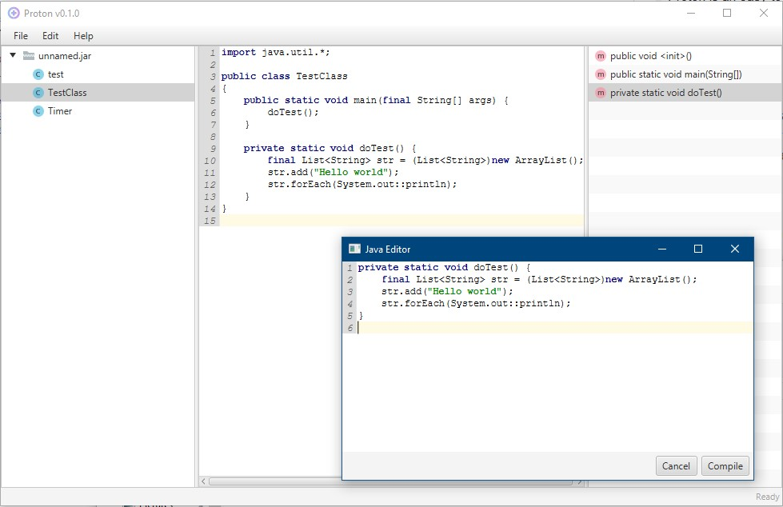

## Overview
Proton is an easy-to-use JAR file modification tool. You can edit the java code even if you don't have sources available.
No more manual writing of bytecode (you can still do that though if you want).

### Features
- Decompile JAR files to Java
- Modify methods in a compiled class using Java
- Bytecode editor for low-level method modification
- JavaFX GUI that works on high-resolution screens

### TODO
- Adding / removing methods and types

### Used libraries
- [Procyon decompiler](https://bitbucket.org/mstrobel/procyon): Java decompiler engine
- [ObjectWeb ASM](https://asm.ow2.io/): Class file / bytecode modification library
- [Apache Commons IO](https://commons.apache.org/proper/commons-io/): Java I/O utilities